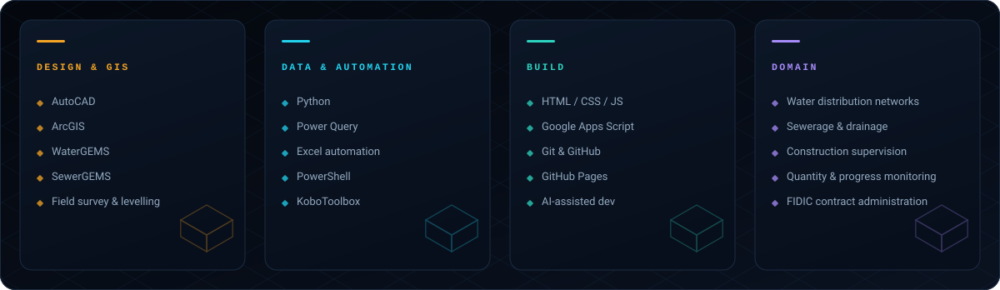

  <picture>
    <source media="(prefers-color-scheme: dark)" srcset="assets/hero-dark.svg">
    <source media="(prefers-color-scheme: light)" srcset="assets/hero-light.svg">
    
  </picture>

  
  
  
  

---

I'm a civil engineer in **Dhaka, Bangladesh**, working on water distribution and sewerage
networks — and I write the software that runs alongside that work.

Progress trackers, quantity workbooks, survey pipelines, GIS automation, batch document
tooling. Nearly all of it starts the same way: someone is maintaining a spreadsheet by hand,
and it is quietly costing the project a week every month.

**M.Sc.** Environment &amp; Disaster Management — Jagannath University, Dhaka&nbsp;&nbsp;·&nbsp;&nbsp;**B.Sc.** Civil Engineering — BAUET

## Stack

  <picture>
    <source media="(prefers-color-scheme: dark)" srcset="assets/stack-dark.svg">
    <source media="(prefers-color-scheme: light)" srcset="assets/stack-light.svg">
    
  </picture>

## Selected work

### [WD6B Dynamic Progress Tracker](https://github.com/rahatce98/dsip-tracker)

A multi-item progress panel for a sewerage construction programme. Pipe laying, manhole
structures, inspection pits and service connections are each tracked by segment, supervising
group and work phase, then rolled up into a dashboard with per-segment summaries and an Excel
export. Single page, local-storage persistence, no backend to keep alive.

`HTML` &nbsp;`JavaScript` &nbsp;`Excel export`

### [CONPLANPRO — Construction Resource Planner](https://github.com/rahatce98/Construction-Planner-pro)

Turns a project brief into a complete resource planning package: project details, manpower
roster, equipment register, work schedule, organogram, risks and safety notes — exported as
PDF, Excel and Word. Ships with default templates so a new project starts from a sensible
baseline instead of an empty table.

`HTML` &nbsp;`JavaScript` &nbsp;`PDF / XLSX / DOCX export`

### [Portfolio template](https://github.com/rahatce98/portfolio)

A zero-dependency static portfolio. One `index.html`, all content driven from a single
`data.js`, and no image files at all — every visual is CSS or inline SVG, so the whole thing
loads instantly and deploys to GitHub Pages with no build step. Semantic markup, keyboard
navigable, honours `prefers-reduced-motion`.

`HTML` &nbsp;`CSS` &nbsp;`JavaScript`

### Document &amp; field automation

The unglamorous tools that give back the most hours — batch printing without killing the PDF
reader ([here](https://github.com/rahatce98/Auto-Print-Without-Killing-PDF-reader)), batch
Word printing ([here](https://github.com/rahatce98/Batch-Print-Word-File-)), KoboToolbox forms
for field data collection ([here](https://github.com/rahatce98/Kobotoolbox)), plus
[ArcGIS](https://github.com/rahatce98/Arcgis) and [CAD](https://github.com/rahatce98/CAD)
working files.

## Currently

- Supervising sewer network construction and quantity monitoring on a Dhaka water &amp; sewerage programme
- Moving the daily site reporting workbook off the desktop and onto a phone-friendly web app
- Getting better at hydraulic modelling — and reading far too much technical analysis on the side

   
  
  

  If it gets done by hand twice, it should have been a script.

